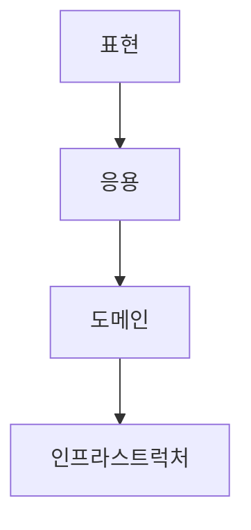

# 2장. 아키텍처 개요

## 📚 목차
- 2.1 네 개의 영역
- 2.2 계층 구조 아키텍처
- 2.3 DIP
    - 2.3.1 DIP 주의사항
    - 2.3.2 DIP와 아키텍처
- 2.4 도메인 영역의 주요 구성요소
    - 2.4.1 엔티티와 밸류
    - 2.4.2 애그리거드
    - 2.4.3 리포지터리
- 2.5 요청 처리 흐름 
- 2.6 인프라스트럭처 개요
- 2.7 모듈 구성

---

### 🔍 네 개의 영역
- 표현 영역(또는 UI 영역)  
    사용자의 요청을 받아 응용 영역에 전달하고 응용 영역의 처리 결과를 다시 사용자에게 보여주는 역할을 한다.   
    사용자의 요청을 해석해서 응용 서비스에 전달하고 응용 서비스의 실행 결과를 사용자가 이해할 수 있는 형식으로 변환하여 응답한다.

- 응용 영역  
    시스템이 사용자에게 제공해야 할 기능을 구현한다.
    기능을 구현하기 위해 도메인 영역의 도메인 모델을 사용한다.
    로직을 직접 수행하기보다는 도메인 모델에 로직 수행을 위임한다.

- 도메인 영역  
    도메인 모델(도메인의 핵심 로직을 구현)을 구현한다.

- 인프라스트럭처 영역  
    구현 기술에 대한 것을 다룬다.
    논리적인 개념을 표현하기보다는 실제 구현을 다룬다.

&rarr; 도메인 영역, 응용 영역, 표현 영역은 구현 기술을 사용한 코드를 직접 만들지 않는다. 대신 인프라스트럭처 영역에서 제공하는 기능을 사용해서 필요한 기능을 개발한다.

### 🔍 계층 구조 아키텍처


네 영역을 구성할 때 많이 사용하는 아키텍처는 위와 같은 계층 구조이다.  
계층 구조는 그 특성상 상위 계층에서 하위 계층으로의 의존만 존재하고 하위 계층은 상위 계층에 의존하지 않는다.  
띠라서 표현, 응용, 도메인 계층이 상세한 구현 기술을 다루는 인프라스트럭처 계층에 종속되게 된다.  
인프라스트럭처에 의존하게 되면 '테스트 어려움'과 '기능 확장의 어려움'이라는 두 가지 문제가 발생한다.

### 🔍 DIP(Dependency Inversion Principle: 의존 역전 원칙)
고수준 모듈이 제대로 동작하려면 저수준 모듈을 사용해야 하는데, 이렇게 되면 앞서 계층 구조 아키텍처에서 언급한 두 가지 문제(테스트 어려움, 기능 확장의 어려움)가 발생한다.  
DIP는 이 문제를 해결하기 위해 추상화한 인터페이스를 활용하여 저수준 모듈이 고수준 모듈에 의존하도록 바꾼다.
- #### DIP 주의사항
    DIP를 잘못 생각하면 단순히 인터페이스와 구현 클래스를 분리하는 정도로 받아들일 수 있다.  
    DIP를 적용할 때 하위 기능을 추상화한 인터페이스는 고수준 모듈 관점에서 도출한다.

- #### DIP와 아키텍처
    인프라스트럭처 영역은 구현 기술을 다루는 저수준 모듈이고 응용 영역과 도메인 영역은 고수준 모듈이다.  
    아키텍처에 DIP를 적용하면 아래와 같은 구조가 된다.
    ```mermaid
    graph TD
    A[인프라스트럭처]-->B[응용]-->C[도메인]
    ```
    인프라스트럭처에 위치한 클래스가 도메인이나 응용 영역에 정의한 인터페이스를 상속받아 구현하는 구조가 되므로 도메인 영역에 대한 영향을 주지 않거나 최소화하면서 구현 기술을 변경하는 것이 가능하다.  
    💡 무조건 DIP를 적용하려고 시도하지 말고 DIP의 이점을 얻는 수준에서 적용 범위를 검토해 보자

### 🔍 도메인 영역의 주요 구성요소
|요소|설명|
| --- | --- |
|엔티티|고유의 식별자를 갖는 객체로 자신의 라이프 사이클을 갖는다.<br>도메인 고유의 개념을 표현한다.<br>도메인 모델의 데이터를 포함하며 해당 데이터와 관련된 기능을 함께 제공한다.|
|밸류|고유의 식별자를 갖지 않는 객체로 주로 개념적으로 하나인 값을 표현할 때 사용된다.<br>엔티티의 속성으로 사용할 뿐만 아니라 다른 밸류 타입의 속성으로도 사용할 수 있다.|
|애그리거트|연관된 엔티티와 밸류 객체를 개념적으로 하나로 묶은 것이다.|
|리포지터리|도메인 모델의 영속성을 처리한다.|
|도메인 서비스|특정 엔티티에 속하지 않은 도메인 로직을 제공한다.<br>도메인 로직이 여러 엔티티와 밸류를 필요로 하면 도메인 서비스에서 로직을 구현한다.|

- #### 엔티티와 밸류
    DB 모델의 엔티티와 도메인 모델의 엔티티의 가장 큰 차이점은 도메인 모델의 엔티티는 데이터와 함께 도메인 기능을 함께 제공한다는 점이다.  
    도메인 모델의 엔티티는 단순히 데이터를 담고 있는 데이터 구조라기보다는 데이터와 함께 기능을 제공하는 객체이다. 도메인 관점에서 기능을 구현하고 기능 구현을 캡슐화해서 데이터가 임의로 변경되는 것을 막는다.  
    도메인 모델의 엔티티는 두 개 이상의 데이터가 개념적으로 하나인 경우 밸류 타입을 이용해서 표현할 수 있으나, DB 모델은 밸류 타입을 제대로 표현하기 힘들다. 

- #### 애그리거트
    도메인 모델을 개별 객체뿐만 아니라 상위 수준에서 볼 수 있어야 전체 모델의 관계와 개별 모델을 이해하는 데 도움이 된다. 도메인 모델에서 전체 구조를 이해하는 데 도움이 되는 것이 애그리거트이다.  
    애그리거트는 관련 객체를 하나로 묶은 군집이다.  
    애그리거트를 사용하면 개별 객체가 아닌 관련 객체를 묶어서 객체 군집 단위로 모델을 바라볼 수 있게 된다.  
    개별 객체 간의 관계가 아닌 애그리거트 간의 관계로 도메인 모델을 이해하고 구현하게 되며, 이를 통해 큰 틀에서 도메인 모델을 관리할 수 있다.

- #### 리포지터리
    도메인 객체를 지속적으로 사용하려면 물리적인 저장소에 도메인 객체를 보관해야 하는데, 이를 위한 도메인 모델이 리포지터리이다.  
    엔티티나 밸류가 요구사항에서 도출되는 도메인 모델이라면 리포지터리는 구현을 위한 도메인 모델이다.  
    리포지터리는 애그리거트 단위로 도메인 객체를 저장하고 조회하는 기능을 정의한다.

### 🔍 요청 처리 흐름
사용자가 애플리케이션에 기능 실행을 요청하면 그 요청을 처음 받는 영역이 표현 영역이다.  
표현 영역은 사용자가 전송한 데이터 형식이 올바른지 검사하고 문제가 없다면 데이터를 이용해서 응용 서비스에 기능 실행을 위임한다. 이 때 표현 영역은 사용자가 전송한 데이터를 응용 서비스가 요구하는 형식으로 변환해서 전달한다.  
응용 서비스는 도메인 모델을 이용해서 기능을 구현한다.  
기능 구현에 필요한 도메인 객체를 리포지터리에서 가져와 실행하거나 신규 도메인 객체를 생성해서 리포지터리에 저장한다.

### 🔍 인프라스트럭처 개요
인프라스트럭처는 표현 영역, 응용 영역, 도메인 영역을 지원한다.  
도메인 영역과 응용 영역에서 인프라스트럭처의 기능을 직접 사용하는 것보다 이 두 영역에 정의한 인터페이스를 인프라스트럭처 영역에서 구현하는 것이 시스템을 더 유연하고 테스트하기 쉽게 만들어준다.  
하지만 무조건 인프라스트럭처에 대한 의존을 없앨 필요는 없다.  
구현의 편리함은 DIP가 주는 장점만큼 중요하기 때문에 DIP의 장점을 해치지 않는 범위에서 응용 영역과 도메인 영역에서 구현 기술에 대한 의존을 가져가는 것이 나쁘지 않다고 생각한다. (ex. 자바의 @Transactional)

### 🔍 모듈 구성
아키텍처의 각 영역은 별도 패키지에 위치한다.  
도메인이 크면 하위 도메인으로 나누고 각 하위 도메인마다 별도 패키지를 구성한다.  
도메인 모듈은 도메인에 속한 애그리거트를 기준으로 다시 패키지를 구성한다.  
애그리거트, 모델, 리포지터리는 같은 패키지에 위치시킨다.  
모듈 구조에 대해 정해진 규칙은 없고 한 패키지에 너무 많은 타입이 몰려서 코드를 찾을 때 불편할 정도만 아니면 된다.
